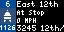

# CapMetro Tidbyt App

## Overview

Displays real-time Capital Metro (Austin, TX) departure predictions on a [Tidbyt](https://tidbyt.com/) device.



Shows the next 2 bus or rail arrivals across up to 3 configured stops — pulled live from the CapMetro GTFS-RT trip updates feed. Each row shows a color-coded route badge, arrival ETA ("Due" / "In N min" / ">1 hr"), and a scrolling stop name.

## Getting started

In the Tidbyt app, set **Stop 1** (required), **Stop 2**, and **Stop 3** (optional) to the numeric CapMetro stop IDs you want to monitor. For example, stop `603` is 31st Street Station northbound.

Find your stop ID on [CapMetro's trip planner](https://capmetro.org) or in the [GTFS static feed](https://data.texas.gov/dataset/CapMetro-GTFS/eiei-9rpf).

## Usage

Requires the [pixlet](https://github.com/tidbyt/pixlet) CLI.

```bash
# Preview locally
pixlet serve CapMetro.star

# Render to image
pixlet render CapMetro.star

# Push to device
pixlet push --api-token <token> <device-id> capmetro.webp
```

## License

MIT © 2026 Dan Ziegler
