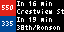

# CapMetro Tidbyt App

## Overview

Displays real-time Capital Metro (Austin, TX) departure predictions on a [Tidbyt](https://tidbyt.com/) device.



Shows the next bus or rail arrivals across up to four configured stops — pulled live from the CapMetro GTFS-RT trip updates feed. Choose how many departures to show (1–4); each one gets a color-coded route badge, an arrival ETA ("Due" / "In 8 min" / ">1 hr"), and its stop name.

## Getting started

In the Tidbyt app, set **Stop 1** through **Stop 4** to the numeric CapMetro stop IDs you want to monitor. All four are optional — stop `603`, 31st Street Rapid Station (NB), is used if you leave Stop 1 blank.

**Departures shown** picks how many arrivals appear at once, 1 to 4. The stops act as one pool: the app collects every upcoming departure across them and shows that many of the soonest, so setting four stops and two departures is a perfectly normal way to use it. The layout adapts to how many departures were actually found, so a quiet stop never leaves blank rows.

Find your stop ID on [CapMetro's trip planner](https://www.capmetro.org/planner) — it appears in the stop URL and on the printed sign at the stop — or in the `stops.txt` file of the [GTFS static feed](https://data.texas.gov/dataset/CapMetro-GTFS/eiei-9rpf).

## Running it locally

Requires the [pixlet](https://github.com/tidbyt/pixlet) CLI.

```bash
# Preview with live reload at http://localhost:8080
pixlet serve capmetro.star

# Render to an image. Note the default output name is capmetro.webp,
# which is the README preview above - write elsewhere to avoid clobbering it.
pixlet render capmetro.star -o /tmp/capmetro.webp

# Push to device
pixlet push --api-token <token> <device-id> /tmp/capmetro.webp
```

### Credentials

Copy `.env.example` to `.env` and fill in your Tidbyt API token and device ID — both come from the Tidbyt mobile app under **Settings → Developer**. `.env` is gitignored; never commit it.

```bash
cp .env.example .env
set -a && . ./.env && set +a
pixlet push --api-token "$TIDBYT_API_TOKEN" "$TIDBYT_DEVICE_ID" /tmp/capmetro.webp
```

## How it works

`capmetro.star` is the entire app — one [Starlark](https://github.com/google/starlark-go/blob/master/doc/spec.md) file with no imports beyond the Tidbyt standard library (`render`, `http`, `cache`, `encoding/base64`, `schema`, `time`). `manifest.yaml` carries the metadata needed to publish to the [Tidbyt community app repo](https://github.com/tidbyt/community); that repo requires a lowercase filename, which is why the app is `capmetro.star` and not `CapMetro.star`.

Each render:

1. Reads the four stop fields and the departure count from config.
2. Returns the "No stops set" screen without touching the network if nothing is configured.
3. Serves from a 60-second cache when one is warm, keyed on the stop set and the count.
4. Otherwise fetches the GTFS trip updates feed and collects the soonest upcoming arrivals across every configured stop.
5. Falls back to a "Feed unavailable" or "No departures" screen rather than failing, if the feed is unreachable or has nothing upcoming.

Absolute arrival times are what gets cached; the ETA is recomputed on every render, so a cached result never shows a stale countdown.

Route colors and stop names are baked into the app as lookup tables generated from the GTFS feed — blue for local routes, gray for MetroRapid, red for express and rail. A route the feed reports but the table doesn't know falls back to a black badge, and an unknown stop ID renders as `Stop 1145`.

### Layouts

The 64×32 display uses one of five layouts, chosen by how many departures were actually found — never by how many you asked for, so the screen is never half-empty.

| departures | layout |
| --- | --- |
| 1 | full-height bar in the route's color, dome above the route number, stop name and ETA centered beside it |
| 2, same route | one merged bar; the text column still names both stops |
| 2, different routes | two 16px badges beside four lines of text |
| 3 | the soonest keeps the two-line treatment; the other two become compact rows |
| 4 | four compact rows |

A compact row is a badge, the stop name (scrolling if it's too long), and an abbreviated ETA — `Due`, `8m`, `>1h` — right-aligned in a fixed-width column, so the ETAs read as a column against ragged stop names.

## Contributing

Branch names follow `(feat|fix|refactor|chore|docs|test)/short-slug`, prefixed with an issue number when there is one. Everything merges to `main` via PR; branches are deleted after merge.

Every PR needs at least one label — `ui`, `data`, `infra`, `P1`&ndash;`P3`, or a `type:` label — because release notes are grouped by PR label via `.github/release.yml`.

Releases are [semver](https://semver.org/), tagged `vMAJOR.MINOR.PATCH` on `main` after merge. Changes accumulate under `## [Unreleased]` in [CHANGELOG.md](CHANGELOG.md) and a release is cut once there's a meaningful batch, or immediately for anything breaking — feature branches don't edit the changelog themselves.

## References

- Pixlet: [authoring apps](https://github.com/tidbyt/pixlet/blob/main/docs/authoring_apps.md) · [tutorial](https://github.com/tidbyt/pixlet/blob/main/docs/tutorial.md) · [widgets](https://github.com/tidbyt/pixlet/blob/main/docs/widgets.md) · [fonts](https://github.com/tidbyt/pixlet/blob/main/docs/fonts.md)
- Tidbyt community forum: [discuss.tidbyt.com](https://discuss.tidbyt.com)
- GTFS trip updates — the feed this app reads: [raw feed](https://data.texas.gov/download/mqtr-wwpy/text%2Fplain) · [dataset page](https://data.texas.gov/Transportation/CapMetro-Trip-Updates-JSON-File/mqtr-wwpy). Note it encodes `arrival.time` as a **string**, not a number.
- Other CapMetro feeds, unused by the app today: [vehicle positions](https://data.texas.gov/download/cuc7-ywmd/text%2Fplain) (~122 KB) · [service alerts](https://data.texas.gov/download/9zu9-jwr2/text%2Fplain) (~79 KB, a bare JSON array) · [GTFS static zip](https://data.texas.gov/download/r4v4-vz24/application%2Fzip) (~34 MB, too large for `http.get`)
- CapMetro route maps: [all bus routes](https://www.capmetro.org/ourservices/busroutes) · [a single route](https://www.capmetro.org/schedmap/?svc=0&f1=214) (change `f1=` to the route ID)

## Disclaimer

This is an unofficial, independently built app. It is **not affiliated with,
endorsed by, or supported by** either the Capital Metropolitan Transportation
Authority (CapMetro) or Tidbyt.

"CapMetro" and the CapMetro logo are trademarks of their respective owner, used
here only to identify the transit system whose public data the app displays.
"Tidbyt" and "pixlet" are trademarks of their respective owner, used here only
to identify the hardware the app runs on and the tool used to build it. Neither
organization has reviewed, approved, or endorsed this project.

Arrival times come from CapMetro's public GTFS-Realtime feed and are
**predictions, not guarantees**. The feed may be delayed, incomplete, or
unavailable, and the app caches results for up to 60 seconds. Use at your own
risk — do not rely on it to catch a bus or train, or to make any time-critical
decision. The software is provided "as is", without warranty of any kind, as set
out in the [LICENSE](LICENSE).

## License

MIT © 2026 Dan Ziegler
